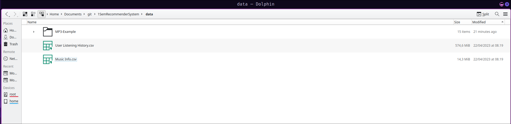

# 1SemRecommenderSystem

This is a repository for the first semester of the Computer Science master's degree.

## Setup

Follow these steps to set up the project locally:

### 1. **Download the Dataset**

Obtain the dataset from [Kaggle](https://www.kaggle.com/datasets/undefinenull/million-song-dataset-spotify-lastfm).

### 2. **Activate Python Virtual Environment**

You should create a Python virtual environment to isolate the project dependencies. Follow the instructions based on your operating system:

#### Linux / macOS
1. Open your terminal.
2. Run the following commands:
   ```bash
   python -m venv venv
   source venv/bin/activate
   ```
#### Windows
1. Open Command Prompt or PowerShell.
2. Run the following commands:
   ```bash
   python -m venv venv
   venv\Scripts\activate
   ```

Now, install the required packages by running the following command. Ensure you are in the project's root directory, where the `setup.py` file is located:
```bash
pip install -r requirements.txt
```

### 3. **Prepare the Data Directory**
   1. In the root directory same place as setup.py run the following command
      - mkdir data

   2. The directory structure should look like this:
   

### 4. **Run `setup.py`**
   After preparing the dataset, run the setup.py script to set up any additional configuration:

   ```bash
   python setup.py
   ```
## Notes
Make sure that Python 3.x is installed. You can verify the version by running:
```bash
python --version
```
